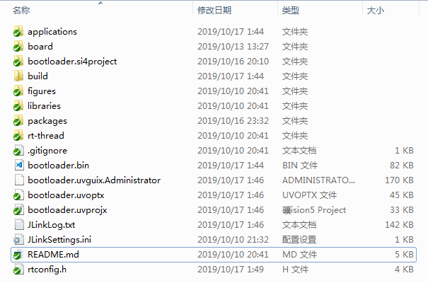
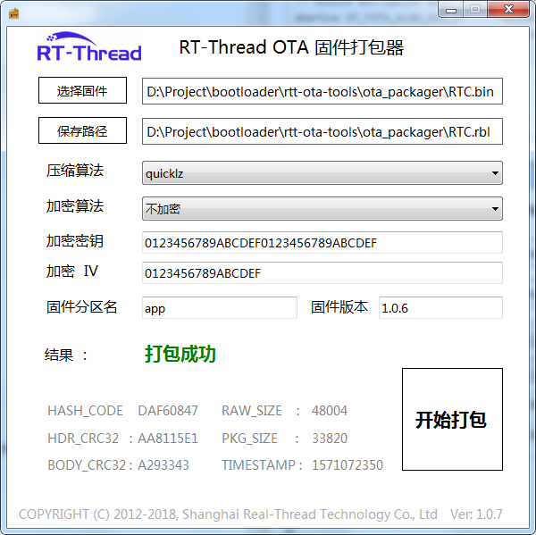
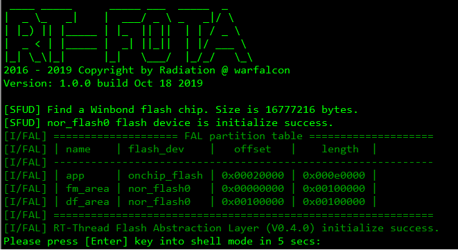
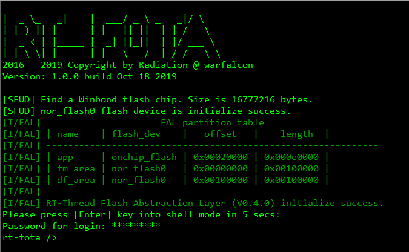

# 基于STM32的开源Bootloader框架-RT-FOTA

## 简介

RT-Thread官方推出了STM32系列单片机的通用bootloader,在其网站可以通过网页配置就可以生成bootloader的烧录文件，使广大嵌入式工程师不用编写一行代码，就能够轻松完成自己产品的bootloader功能。但是由于RTT官方的bootloader软件**RT-OTA**是商用性质，不公开源码，不仅仅限制了在其他平台的移植，而且也不方便加入产品的特定功能。本人软件水平有限，但是基于对开源精神的崇拜和RTT多年的感情，蒙发出利用业余时间编写一款开源的且基于RTT系统bootloader通用软件，贡献给大家。

**由于RTT官方推出的bootloader名字叫RT-OTA，因此为了蹭点RTT的流量，我这个bootloader名字就叫RT-FOTA。**

**【RT-FOTA的需求分析】**

- 开发基于ROTS的bootloader软件，网上很多牛人会说bootloader最好是裸机程序编写，就像u-boot一样稳定和可靠。但我个人认为目前32位单片机资源丰富，RT-Thread的稳定和可靠性不言而喻，加之RTT的组件丰富，后续功能拓展方便（比如加入网络和USB功能）。因此我使用RT-Thread的阉割版本rtt-nano实现。

- 兼容RTT官方的rbl文件：使用RTT官方的打包软件生成下载文件，可以实现加密压缩功能。由于个人水平问题，只能做到尽可能的兼容，比如RBL文件里面的HASH_CODE我就不知道怎么计算出来的。

- 移植方便：由于RT-FOTA基于RT-Thread开发，因此只要你的平台被RT-Thread支持，就可以很方便的移植到。

**【RT-FOTA主要的功能】**

- 支持RTT官方的RBL打包软件，使用方式也一致。目前支持包括CRC32、AES256、quicklz和fastlz功能；
- 支持命令行模式（FINSH组件）和出厂固件恢复；
- 支持FLASH分区（FAL组件）；
- 支持功能扩展（RTT组件）；
- 其他功能可自行方便扩展；

## 软件开发目录 

软件开发目录参照RTT的目录形式，如下图所示：

我原本计划添加SCONS进行编译，但目前对SCONS的使用还不熟悉，下次再实现，因此暂时使用**MDK** 完成。

*可以看到我并未按照RTT官方推荐的使用MDK或cube生成rtt-nano的工程，原因是我有强迫症，感觉IDE生成的目录很不爽。*

## 软件配置说明

RT-FOTA的软件配置仍然集中在rtconfig.h中，其中一些.c文件中有一些默认的配置宏，但可以根据需求进行修改。

	/* RT-Thread config file */
	#ifndef RT_CONFIG_H__
	#define RT_CONFIG_H__
	
	#define RT_THREAD_PRIORITY_MAX  	8
	#define RT_TICK_PER_SECOND			1000
	#define RT_ALIGN_SIZE   			4
	#define RT_NAME_MAX	   				8
	
	/* Kernel Device Object */	
	#define RT_USING_DEVICE
	#define RT_USING_CONSOLE
	#define RT_CONSOLEBUF_SIZE          512
	#define RT_CONSOLE_DEVICE_NAME      "uart1"
	#define RT_VER_NUM 					0x30102
	
	#define RT_USING_CPU_FFS
	
	/* RT-Thread Components */
	#define RT_USING_COMPONENTS_INIT
	#define RT_USING_USER_MAIN
	
	#define RT_DEBUG_INIT 0
	#define RT_USING_OVERFLOW_CHECK
	// #define RT_USING_HOOK
	// #define RT_USING_IDLE_HOOK
	
	/* Software timers Configuration */	
	#define RT_USING_TIMER_SOFT         0
	#if RT_USING_TIMER_SOFT == 0
	#undef RT_USING_TIMER_SOFT
	#endif
	
	#define RT_TIMER_THREAD_PRIO		4
	#define RT_TIMER_THREAD_STACK_SIZE	512
	#define RT_TIMER_TICK_PER_SECOND	100
	
	
	/* IPC(Inter-process communication) Configuration */
	#define RT_USING_SEMAPHORE
	#define RT_USING_MUTEX
	//#define RT_USING_EVENT
	//#define RT_USING_MAILBOX
	//#define RT_USING_MESSAGEQUEUE
	
	/* Memory Management Configuration */
	#define RT_USING_HEAP
	#define RT_USING_MEMHEAP
	#define RT_USING_SMALL_MEM
	
	/* Finsh Configuration */
	#define RT_USING_FINSH
	#define FINSH_USING_MSH
	#define FINSH_USING_MSH_ONLY
	#define __FINSH_THREAD_PRIORITY     5
	#define FINSH_THREAD_PRIORITY       (RT_THREAD_PRIORITY_MAX / 8 * __FINSH_THREAD_PRIORITY + 1)
	#define FINSH_THREAD_STACK_SIZE     2048
	#define FINSH_USING_HISTORY
	#define FINSH_HISTORY_LINES	        5
	#define FINSH_USING_SYMTAB
	#define FINSH_USING_AUTH			/* 可配置FINSH的authencation功能,防止随意使用FINSH */
	#define FINSH_DEFAULT_PASSWORD 		"radiation" 
	#define FINSH_PASSWORD_MIN			6
	#define FINSH_PASSWORD_MAX 			16	
	
	/* Device Drivers */	
	#define RT_USING_PIN
	#define RT_USING_SERIAL
	// #define RT_SERIAL_USING_DMA
	#define RT_USING_RTC
	#define RT_USING_SPI
	#define RT_USING_SFUD
	#define RT_SFUD_USING_SFDP
	#define RT_SFUD_USING_FLASH_INFO_TABLE
	#define RT_USING_WDT
	
	/* RTT组件配置 */
	/* fal package */
	#define PKG_USING_FAL
	#define FAL_DEBUG_CONFIG
	#define FAL_DEBUG 0
	#define FAL_PART_HAS_TABLE_CFG
	#define FAL_USING_SFUD_PORT
	#define FAL_USING_NOR_FLASH_DEV_NAME 	"nor_flash0"
	#define PKG_USING_FAL_LATEST_VERSION
	#define PKG_FAL_VER_NUM 				0x99999
	
	/* Tinycrypt package */
	#define TINY_CRYPT_AES
	
	/* Compress package */
	#define QLZ_COMPRESSION_LEVEL	3
	
	/* Hardware Drivers Config */
	#define SOC_FAMILY_STM32
	#define SOC_SERIES_STM32F4
	#define SOC_STM32F407ZE
	
	/* On-chip Peripheral Drivers */	
	#define BSP_USING_GPIO
	#define BSP_USING_ON_CHIP_FLASH
	#define BSP_USING_ONCHIP_RTC
	#define BSP_USING_UART
	#define BSP_USING_UART1
	#define BSP_USING_SPI
	#define BSP_USING_SPI1
	
	/* Onboard Peripheral Drivers */	
	#define BSP_DATAFALSH_CS_PIN 30
	
	/* Board extended module Drivers */	
	#define BSP_RS485_DIR_PIN 52
	
	/* RT-FOTA module define */
	#define RT_FOTA_SW_VERSION      "1.0.0"
	
	/* Enable Ymodem OTA */
	#define PKG_USING_YMODEM_OTA
	
	/* 分区名字可以根据自己的需求而定 */
	/* FOTA application partition name */
	#ifndef RT_FOTA_APP_PART_NAME
	#define RT_FOTA_APP_PART_NAME   "app"
	#endif	
	/* FOTA download partition name */
	#ifndef RT_FOTA_FM_PART_NAME
	#define RT_FOTA_FM_PART_NAME    "fm_area"
	#endif	
	/* FOTA default partition name */
	#ifndef RT_FOTA_DF_PART_NAME
	#define RT_FOTA_DF_PART_NAME    "df_area"
	#endif
	
	/* 此两项密码必须与RTT的打包软件设置一致 */
	/* AES256 encryption algorithm option */
	#define RT_FOTA_ALGO_AES_IV  	"0123456789ABCDEF"
	#define RT_FOTA_ALGO_AES_KEY 	"0123456789ABCDEF0123456789ABCDEF"	
	#endif

## RBL文件说明

使用过RTT官方的RT-OTA组件的朋友都知道，下载的不是bin文件，而是需要通过RTT打包软件“装饰”成rbl文件之后，才能被RT-OTA识别。

RTT的打包软件可以设置代码加密和压缩，其配置信息都存在rbl文件前96字节中：

	rt-fota />fota show fm_area 0 96
	00000000: 52 42 4C 00 00 02 00 00 5E A9 A4 5D 61 70 70 00 
	00000010: 00 00 00 00 00 00 00 00 00 00 00 00 31 2E 30 2E 
	00000020: 36 00 00 00 00 00 00 00 00 00 00 00 00 00 00 00 
	00000030: 00 00 00 00 31 2E 30 2E 36 00 00 00 00 00 00 00 
	00000040: 00 00 00 00 00 00 00 00 00 00 00 00 43 33 29 0A 
	00000050: 47 08 F6 DA 84 BB 00 00 1C 84 00 00 C4 3D E3 B5

其具体含义如下：

	typedef struct {
		char type[4];				/* RBL字符头 */ 
		rt_uint16_t fota_algo;		/* 算法配置: 表示是否加密或者使用了压缩算法 */
		rt_uint8_t fm_time[6];		/* 原始bin文件的时间戳, 6位时间戳, 使用了4字节, 包含年月日信息 */
		char app_part_name[16];		/* app执行分区名 */
		char download_version[24];	/* 固件代码版本号 */
		char current_version[24];	/* 这个域在rbl文件生成时都是一样的，我用于表示app分区当前运行固件的版本号，判断是否固件需要升级 */
		rt_uint32_t code_crc;		/* 代码的CRC32校验值,它是的打包后的校验值,即rbl文件96字节后的数据 */
		rt_uint32_t hash_val;		/* 估计这个域是指的原始代码本身的校验值，但不知道算法，无法确认，故在程序中未使用 */
		rt_uint32_t raw_size;		/* 原始代码的大小 */
		rt_uint32_t com_size;		/* 打包代码的大小 */
		rt_uint32_t head_crc;		/* rbl文件头的CRC32校验值，即rbl文件的前96字节 */
	} rt_fota_part_head, *rt_fota_part_head_t;

## 开机界面

RT-FOTA开机界面如下图：

可以看出使用了RTT的SFUD和FAL组件，同时列出了分区变信息。

*RT-FOTA源码公开，你想怎么改就怎么改,不在受限制：)*

最后一行是表示在5秒钟内，按下Enter键，即0x0d，就可以进入命令行模式：

由于FINSH具备authencation功能，可以设置shell密码。具体详见RTT相关文档。

## 命令行模式

RT-FOTA的命令行模式使用的RTT的FINSH组件, 除了RTT系统自带命令外，还增加fota和ymdown命令：

**fota命令**

键入fota命令后回车即可看到帮助命令：

	rt-fota />fota
	Usage:
	fota probe                       - probe RBL file of partiton
	fota show partition addr size    - show 'size' bytes starting at 'addr'
	fota clone des_part src_part     - clone src partition to des partiton
	fota exec                        - execute application program

**probe参数可以打印出当分区的RBL信息：**

    rt-fota />fota probe
	[I/fota] ===== RBL of fm_area partition =====
	[I/fota] | App partition name |         app |
	[I/fota] | Algorithm mode     |  AES && QLZ |
	[I/fota] | Firmware version   |       1.0.3 |
	[I/fota] | Code raw size      |       48004 |
	[I/fota] | Code package size  |       33824 |
	[I/fota] | Build Timestamp    |  1571072350 |
	[I/fota] ===== RBL of df_area partition =====
	[I/fota] | App partition name |         app |
	[I/fota] | Algorithm mode     |  AES && QLZ |
	[I/fota] | Firmware version   |       1.0.3 |
	[I/fota] | Code raw size      |       48004 |
	[I/fota] | Code package size  |       33824 |
	[I/fota] | Build Timestamp    |  1571072350 |

这里列出了fm_area和df_area分区中RBL文件的主要信息项,便于开发者查询：

*App partition name*: 指的是RTT打包文件时设置的分区名

*Algorithm mode*    : 指的是RTT打包文件使用那些算法：AES256/Quicklz/Fastlz

*Firmware version*  : 指的是RTT打包文件设置的固件版本号

*Code raw size*     : 指的代码原始大小

*Code package size* : 指的代码打包后的大小

*Build Timestamp*   : 指的代码生成的时间戳

**show参数可以显示分区的具体实际数据，方便调试与检查：**

    rt-fota />fota show app 0 96
	00000000: C0 08 00 20 E5 57 02 08 5D 04 02 08 5F 04 02 08 
	00000010: 63 04 02 08 67 04 02 08 6B 04 02 08 00 00 00 00 
	00000020: 00 00 00 00 00 00 00 00 00 00 00 00 6F 04 02 08 
	00000030: 71 04 02 08 00 00 00 00 73 04 02 08 75 04 02 08 
	00000040: FF 57 02 08 FF 57 02 08 FF 57 02 08 49 55 02 08 
	00000050: FF 57 02 08 FF 57 02 08 FF 57 02 08 FF 57 02 08 

这里列出了app分区0到96字节的数据

**clone参数是实现分区数据克隆**

    rt-fota />fota clone fm_area df_area
	Clone df_area partition to fm_area partition:
	#########################################################
	#########################################################
	#########################################################
	#########################################################
	############################
	Clone partition success, total 1048576 bytes!

这里是将df _ area分区数据完整的克隆岛fm _ area中。

**exec参数是用于执行app分区的应用代码**

    rt-fota />fota exec
	[I/fota] Implement application now.
	 LCD ID:5510

**ymdown命令**

**ymdown**是基于Ymodem协议的下载命令，使用RTT的ymodem和ymodem _ ota组件实现，其中将ymodem _ ota.c中的**DEFAULT_DOWNLOAD_PART**设置为需要默认使用分区名，即在使用**ymdown**不带参数的情况下就下载到**DEFAULT_DOWNLOAD_PART**分区，也可加分区名作为参数指定下载位置。

	rt-fota />ymdown
	Default save firmware on download partition.
	Warning: Ymodem has started! This operator will not recovery.
	Please select the ota firmware file and use Ymodem to send.
	CCCCCC
	Starting ymodem transfer.  Press Ctrl+C to cancel.
	  100%      33 KB    6 KB/s 00:00:05       0 Errors
	
	Download firmware to flash success.
	Download firmware verify........[OK]
	Reset system and apply new firmware.

下载完成后，会自动复位重新启动，将新固件搬运到app分区中：

	 ____ _____      _____ ___  _____  _        
	|  _ \_   _|    |  ___/ _ \ _   _|/ \      
	| |_) || |_____ | |_  || ||  | | / _ \      
	|  _ < | |_____ |  _| ||_||  | |/ ___ \     
	|_| \_\|_|      |_|   \___/  |_/_/   \_\  
	2016 - 2019 Copyright by Radiation @ warfalcon 
	Version: 1.0.0 build Oct 18 2019
	
	[SFUD] Find a Winbond flash chip. Size is 16777216 bytes.
	[SFUD] nor_flash0 flash device is initialize success.
	[I/FAL] ==================== FAL partition table ====================
	[I/FAL] | name    | flash_dev    |   offset   |    length  |
	[I/FAL] -------------------------------------------------------------
	[I/FAL] | app     | onchip_flash | 0x00020000 | 0x000e0000 |
	[I/FAL] | fm_area | nor_flash0   | 0x00000000 | 0x00100000 |
	[I/FAL] | df_area | nor_flash0   | 0x00100000 | 0x00100000 |
	[I/FAL] =============================================================
	[I/FAL] RT-Thread Flash Abstraction Layer (V0.4.0) initialize success.
	Please press [Enter] key into shell mode in 5 secs:
	[I/fota] Partition[app] erase start:
	[I/fota] Start to copy firmware from fm_area to app partition:
	############
	[I/fota] Upgrade success, total 48004 bytes.
	[I/fota] Copy firmware version Success!
	[I/fota] Implement application now.
	 LCD ID:5510

## 出厂固件恢复

恢复出厂固件的方式比较多，本人多年的工程实践经验，倾向于使用外部按键长按后进行出厂固件恢复。出厂固件存储在df _ area分区中（分区名在代码中任意设置），长按按键10s后(长按时间在代码中任意设置)，RT-FOTA会自动解密解压df _ area分区代码，并搬运到app分区进行执行。

	Default firmware key pressed:
	>>>>>>>>>>
	[I/fota] Partition[app] erase start:
	[I/fota] Start to copy firmware from df_area to app partition:
	############
	[I/fota] Upgrade success, total 48004 bytes.
	[I/fota] Implement application now.
	 LCD ID:5510

## RT-FOTA移植

RT-FOTA移植很简单，只要RT-Thread源码包中有你的平台的BSP包即可：）

RT-FOTA中使用的各种组件的修改也很简单，比如FAL和SFUD就可以参照RTT官方说明，SignalLED参照源码包里的README.md即可。

RT-FOTA可以直接使用在RT-Thread的完整版搭载，只需要将*rt _ fota.c*、*rt _ fota.h*和*rt _ fota_crc.c*放入工程中即可实现，然后用env配置相关组件即可。

### 编译下载

双击 bootloader.uvprojx 文件，打开 MDK5 工程，编译并下载程序到开发板。

> 工程默认配置使用 JLINK 仿真器下载程序，点击下载按钮即可下载程序到开发板

### 运行结果

下载程序成功之后，系统RT-FOTA会运行：

- 启动后LED会常亮；
- 如果进入shell模式, LED会1Hz闪烁；
- 如果进入upgrade模式, LED会10Hz闪烁；

连接目标板的串口1到 PC , 在终端工具里打开相应的串口（115200-8-1-N），复位设备后，可以看到 RT-FOTA 的输出信息:

	 ____ _____      _____ ___  _____  _        
	|  _ \_   _|    |  ___/ _ \ _   _|/ \      
	| |_) || |_____ | |_  || ||  | | / _ \      
	|  _ < | |_____ |  _| ||_||  | |/ ___ \     
	|_| \_\|_|      |_|   \___/  |_/_/   \_\  
	2016 - 2019 Copyright by Radiation @ warfalcon 
	Version: 1.0.0 build Oct 18 2019
	
	[SFUD] Find a Winbond flash chip. Size is 16777216 bytes.
	[SFUD] nor_flash0 flash device is initialize success.
	[I/FAL] ==================== FAL partition table ====================
	[I/FAL] | name    | flash_dev    |   offset   |    length  |
	[I/FAL] -------------------------------------------------------------
	[I/FAL] | app     | onchip_flash | 0x00020000 | 0x000e0000 |
	[I/FAL] | fm_area | nor_flash0   | 0x00000000 | 0x00100000 |
	[I/FAL] | df_area | nor_flash0   | 0x00100000 | 0x00100000 |
	[I/FAL] =============================================================
	[I/FAL] RT-Thread Flash Abstraction Layer (V0.4.0) initialize success.

## 注意事项

- RT-FOTA使用正点原子的探险者开发板，如果要运行到其他目标板，可能需要修改相关设置；

- 代码中使用的硬件有usart0、spi0、PE4(key0)、PF9（led0）；

- 由于业余时间开发，文档逐步完善，但只要有一定编程基础的朋友，开代码注释即可知道如果进行相关修改；

## 联系人信息

维护人: 王希

-  [GitHub](https://gitee.com/spunky_973/rt-fota), 邮箱：<7859177@qq.com>